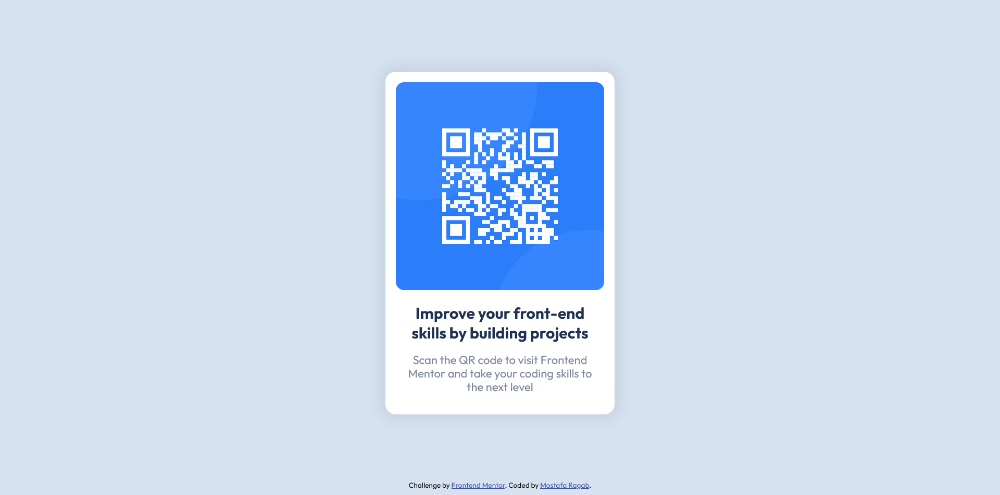

# Frontend Mentor - QR code component solution

This is a solution to the [QR code component challenge on Frontend Mentor](https://www.frontendmentor.io/challenges/qr-code-component-iux_sIO_H). Frontend Mentor challenges help you improve your coding skills by building realistic projects.

## Table of contents

- [Overview](#overview)
- [Screenshot](#screenshot)
- [Links](#links)
- [Built with](#built-with)
- # [Author](#author)

## Overview

This is a frontendmentor.io challenge, and it is to build out QR code component and get it looking as close to the design as possible.

### Screenshot

### Links

- Solution URL: [https://github.com/IMostafaR/Frontend-Mentor-QR-code-component-coding-challenge](https://github.com/IMostafaR/Frontend-Mentor-QR-code-component-coding-challenge)
- Live Site URL: [https://imostafar.github.io/Frontend-Mentor-QR-code-component-coding-challenge/](https://imostafar.github.io/Frontend-Mentor-QR-code-component-coding-challenge/)

### Built with

- Semantic HTML5 markup
- Flexbox

## Author

- Website - [Mostafa Ragab](https://github.com/IMostafaR)
- Frontend Mentor - [@IMostafaR](https://www.frontendmentor.io/profile/IMostafaR)
- Linkedin - [@imostafarh](https://www.linkedin.com/in/imostafarh/)
